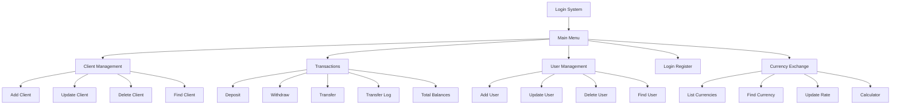
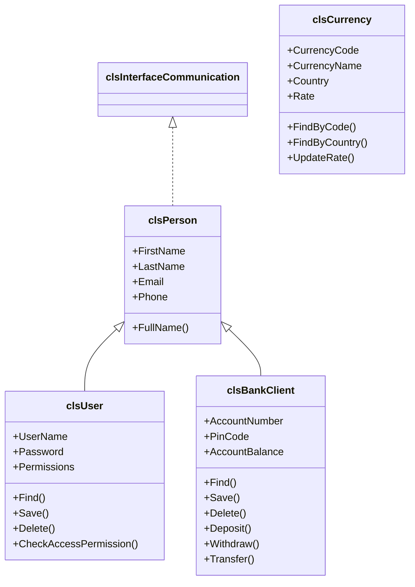
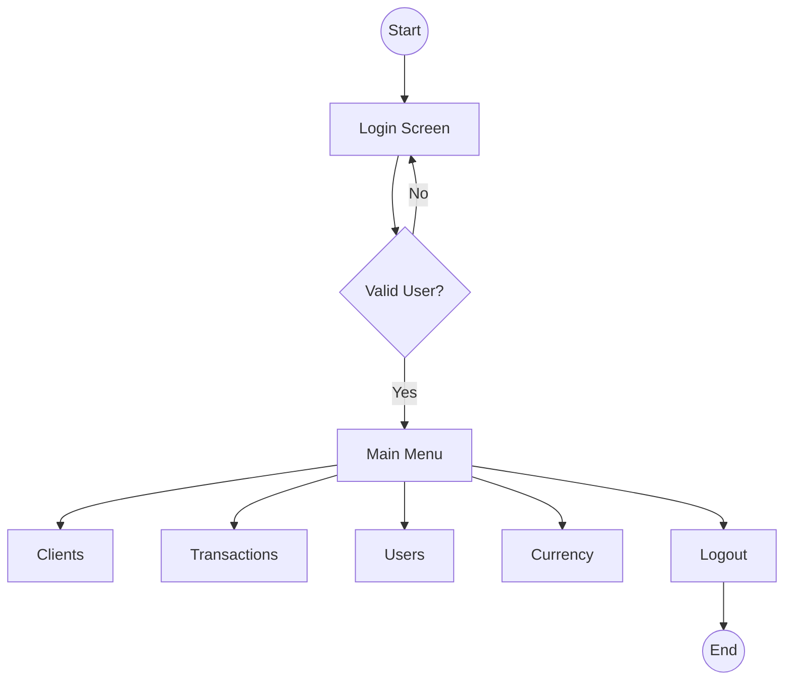
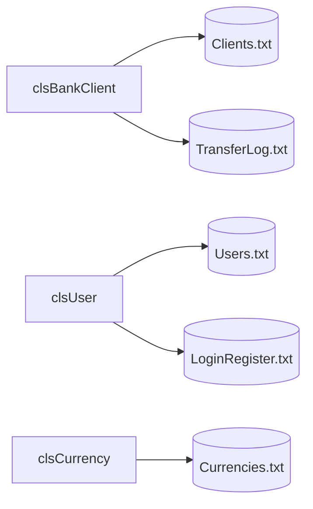

# **E-BankSim v2.0**

**E-BankSim** is a complete console-based banking management system developed in **C++**. The project simulates real-world banking operations such as client management, user authentication, transactions, transfers, permission control, login tracking, and currency exchange.

The application was originally developed using a procedural programming approach and later completely refactored into a full **Object-Oriented Programming (OOP)** architecture to improve maintainability, scalability, and code organization.

---

# **Table of Contents**

1. Features
2. Login Information
3. Permission System
4. Database Structure
5. How It Works
6. Project Structure
7. System Architecture
8. System Diagrams
9. Learning Goals
10. Changes from Previous Version
11. Author

---

# **Features**

## **Client Management (CRUD)**

* Add new clients
* Update client information
* Delete clients
* Search clients by Account Number
* Display all clients

---

## **Transactions**

* Deposit money
* Withdraw money
* Transfer money between accounts
* Display total balances
* View transfer logs

---

## **User Management**

* Add new users
* Update users
* Delete users
* Search users
* Assign custom permissions
* Full Access / Limited Access support

---

## **Authentication & Security**

* Secure login system
* User authentication
* Permission-based access control
* Login history tracking
* Password encryption

---

## **Currency Exchange**

* List all currencies
* Find currencies by code
* Find currencies by country
* Update exchange rates
* Currency conversion calculator

---

## **Command-Line Interface (CLI)**

* Main Menu
* Transactions Menu
* User Management Menu
* Currency Exchange Menu
* Login Register Screen

---

# **Login Information**

### Default Administrator Account

| Username | Password |
| -------- | -------- |
| Admin    | 1234     |

> The administrator account has full access to all system functionalities.

---

# **Permission System**

| Permission        | Value |
| ----------------- | ----- |
| List Clients      | 1     |
| Add Client        | 2     |
| Delete Client     | 4     |
| Update Client     | 8     |
| Find Client       | 16    |
| Transactions      | 32    |
| Login Register    | 64    |
| Manage Users      | 128   |
| Currency Exchange | 256   |
| Full Access       | -1    |

---

# **Database Structure**

### Clients.txt

Stores client information.

| Field           |
| --------------- |
| First Name      |
| Last Name       |
| Email           |
| Phone           |
| Account Number  |
| Pin Code        |
| Account Balance |

---

### Users.txt

Stores user accounts and permissions.

| Field       |
| ----------- |
| First Name  |
| Last Name   |
| Email       |
| Phone       |
| Username    |
| Password    |
| Permissions |

---

### LoginRegister.txt

Stores login history.

| Field       |
| ----------- |
| Date / Time |
| Username    |
| Password    |
| Permissions |

---

### TransferLog.txt

Stores transfer operations.

| Field                     |
| ------------------------- |
| Date / Time               |
| Source Account            |
| Destination Account       |
| Amount                    |
| Source Balance After      |
| Destination Balance After |
| User                      |

---

### Currencies.txt

Stores currency exchange rates.

| Field         |
| ------------- |
| Country       |
| Currency Code |
| Currency Name |
| Rate          |

---

All records are stored using the custom delimiter:

```cpp
#//#
```

---

# **How It Works**

1. The application loads data from text files into memory.
2. Users authenticate through the login system.
3. Permissions are validated before opening protected screens.
4. Operations are executed through a structured menu system.
5. Changes are saved immediately back to text files.
6. Login activities and transfers are logged automatically.

---

## **Main Menu**

* Show Client List
* Add New Client
* Delete Client
* Update Client
* Find Client
* Transactions
* Manage Users
* Login Register
* Currency Exchange
* Logout

---

## **Transactions Menu**

* Deposit
* Withdraw
* Total Balances
* Transfer
* Transfer Log
* Back to Main Menu

---

## **User Management Menu**

* List Users
* Add User
* Delete User
* Update User
* Find User
* Back to Main Menu

---

## **Currency Exchange Menu**

* List Currencies
* Find Currency
* Update Currency Rate
* Currency Calculator
* Back to Main Menu

---

# **Project Structure**

```text
E-BankSim.cpp

├── Core Classes
│   ├── Person.h
│   ├── User.h
│   ├── BankClient.h
│   └── Currency.h
│
├── Screens
│   ├── LoginScreen.h
│   ├── MainScreen.h
│   ├── TransactionsScreen.h
│   ├── ManageUsersLib.h
│   ├── CurrencyMainScreen.h
│   └── Other Screen Classes
│
├── Utilities
│   ├── StringLib.h
│   ├── DateLib.h
│   ├── InputValidation.h
│   ├── UtilLib.h
│
├── Data Files
│   ├── Clients.txt
│   ├── Users.txt
│   ├── LoginRegister.txt
│   ├── TransferLog.txt
│   └── Currencies.txt
│
└── README.md
```

---

# **System Architecture**

```text
Login System
      │
      ▼
 Main Menu
 ├── Client Management
 ├── Transactions
 ├── User Management
 ├── Login Register
 └── Currency Exchange
```

---

# **System Diagrams**

### **Complete System Architecture**



### **UML Class Diagram**



### **Navigation Flow**



### **File Storage Diagram**



---

# **Learning Goals**

This project was created to practice and improve:

* Object-Oriented Programming (OOP)
* Inheritance
* Encapsulation
* Abstraction
* Interfaces
* File Handling
* Data Persistence
* Authentication Systems
* Permission Systems
* Banking System Simulation
* Modular Software Design

---

# **Changes from Previous Version**

| Feature                   | v0.1                   | v2.0                              |
| ------------------------- | ---------------------- | --------------------------------- |
| Programming Style         | Procedural Programming | Object-Oriented Programming (OOP) |
| Client CRUD               | Available              | Refactored using Classes          |
| User Management           | Available              | Improved & Refactored             |
| Permissions System        | Available              | Improved                          |
| Authentication System     | Basic Login            | Enhanced Authentication           |
| Transfers                 | Available              | Improved & Refactored             |
| Transfer Logs             | Available              | Improved Logging Structure        |
| Currency Exchange         | Not Available          | Added                             |
| Currency Calculator       | Not Available          | Added                             |
| Password Encryption       | Not Available          | Added                             |
| Inheritance               | Not Available          | Added                             |
| Interfaces                | Not Available          | Added                             |
| Encapsulation             | Not Available          | Added                             |
| Multi-Screen Architecture | Limited                | Fully Modular                     |
| Code Organization         | Procedural             | OOP Architecture                  |
| Documentation             | Basic                  | Professional                      |

### **Major Improvements in v2.0**

* Refactored the entire project from Procedural Programming to Object-Oriented Programming (OOP).
* Introduced core classes such as `clsPerson`, `clsUser`, `clsBankClient`, and `clsCurrency`.
* Added inheritance, encapsulation, and interface-based design.
* Added Currency Exchange and Currency Calculator modules.
* Added password encryption for user credentials.
* Improved authentication and permission handling.
* Reorganized the project into modular screen classes.
* Improved maintainability, scalability, and code readability.

---

# **Author**

**Youness Chergui Amin**

C++ Banking Management System Project
